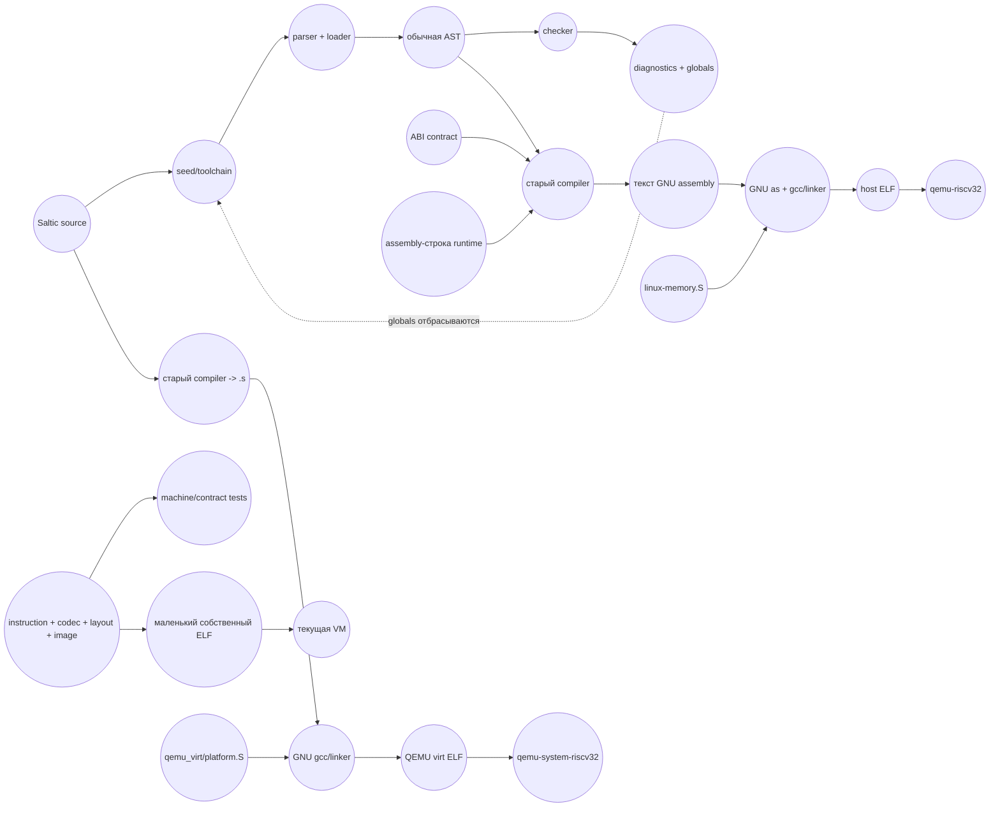

# Полный аудит текущего seed

**Дата:** 24 августа 2026 года

**Область:** `soul/seed`, его активная сборка, bootstrap, VM, QEMU-платформа и проверки закрытия.
**Режим:** полный статический разбор текущих исходников. Шумные сборки и тесты в ходе этого аудита не запускались. Учтены уже полученные результаты: `machine` прошёл 13/13 при куче 512 MiB, а сборка `seed-contract` завершилась `rt_out_of_memory` ещё до появления целевого `.s`.

## Вердикт

`seed` пока не закрыт.

Пункты 1–4 существуют как согласованные **контракты и спецификации**. Пункт 5 имеет настоящий код кодировщика, раскладки и ELF, но ещё не интегрирован в компилятор и не выдерживает размер реального toolchain. Пункты 6–8 по существу не выполнены.

Текущее состояние:

| Пункт | Состояние | Точный смысл |
|---|---|---|
| 1. Однозначная семантика | `ГОТОВО` в объёме плана | Чекер закрывает перечисленные семантические дыры, но не производит типизированную AST для компилятора. |
| 2. Единый ABI | `ГОТОВО` как контракт | ABI описан и проверяется отдельно, но действующие compiler/runtime ему ещё не соответствуют. |
| 3. Константы и память | `ГОТОВО` как контракт | Константы кэшируются, конечная модель описана; реального освобождения памяти нет. |
| 4. Профиль машины | `ГОТОВО` как таблица | 40 базовых и 4 машинные команды описаны; VM и платформа таблицу ещё не исполняют как единый профиль. |
| 5. Кодирование и образ | `ЧАСТИЧНО` | Реализация есть, маленький ELF работает в собственной VM; нет интеграции, масштабируемости и независимого исполнения созданного ELF в QEMU. |
| 6. Перевод compiler/runtime/platform | `НЕ ВЫПОЛНЕНО` | Активный compiler по-прежнему выдаёт GNU assembly, runtime является строкой assembly, платформа остаётся `.S`. |
| 7. Совпадение VM с машиной | `НЕ ВЫПОЛНЕНО` | VM исполняет базовые 40 и Linux-like ecalls, но не 4 машинные команды, CSR и QEMU virt trap-flow. |
| 8. Доказательство замкнутости | `НЕ ВЫПОЛНЕНО` | Закрывающего теста нет, build/bootstrap/test всё ещё используют GNU toolchain. |

Итог: **пункт 5 ещё нельзя пометить готовым**, а переходить к пункту 6 до исправления масштабируемости машинного слоя нельзя — иначе новый compiler упрётся в собственное представление байтов раньше, чем создаст реальный ELF.

### Принятые архитектурные решения

После аудита владелец проекта подтвердил все три решения, необходимые для продолжения:

1. **Типы:** межпроцедурный мономорфный вывод типов по всей загруженной программе. Один `skill` имеет одну выведенную сигнатуру; несовместимые типы его вызовов являются диагностикой. Новый синтаксис типов и runtime-boxing для raw fixed не вводятся.
2. **Память:** неперемещающий точный mark-and-sweep. Managed-объекты получают согласованный header с `FLAG_MARKED`, compiler ведёт точные корни, runtime переиспользует освобождённые блоки. Conservative GC, reference counting и вечный bump-only heap не являются целевыми моделями.
3. **Платформы:** два ELF из общего program/runtime body. Host-композиция исполняется в process-mode собственной VM и `qemu-riscv32`; qemu-virt-композиция — в machine-mode собственной VM и `qemu-system-riscv32`. Универсальный ELF для двух разных сред не требуется.

Эти решения снимают архитектурную неопределённость, но сами по себе не меняют статусы пунктов: соответствующий код ещё предстоит реализовать. Грубая оценка объёма для планирования: типовое представление и вывод — 1000–1700 строк с тестами, object headers/GC/точные корни — 1500–2500; вместе ориентир около 3500 строк, диапазон 2500–4200.

## Что реально происходит сейчас



Главный разрыв виден прямо на схеме: новый `machine` сейчас является боковой веткой тестов. Активная цепочка toolchain его не импортирует.

## Состав и границы

В `soul/seed` сейчас 53 файла `.saltic`, 10 899 строк. Граф обычных `use` ацикличен. Физического `soul/seed.saltic` нет: одиночный `use seed` специально распознаётся загрузчиком как встроенное пространство имён и не загружает файл (`parser/loader.saltic:109–119`).

Это важно для `vision.mmd`: круг `seed.saltic` сейчас обозначает не существующий файл, а концептуальную intrinsic-границу. Если отдельный корневой файл не нужен, на карте его следует называть именно так.

Загрузчик разворачивает все импортированные модули в одну плоскую AST, а compiler компилирует все найденные `skill` без удаления неиспользуемого кода. Поэтому:

- исходники parser/checker/runtime/machine/VM остаются раздельными модулями;
- но тест, импортирующий их все, действительно превращается в очень большой единый ELF;
- `soul/seed/tests/contract.saltic` — не производственный монолит `parser + checker + compiler + runtime + VM`, а агрегирующий тест; его **собранный бинарник** монолитен из-за flattening и отсутствия DCE.

Сам `contract.saltic` не импортирует основной `seed.compiler`; он импортирует `compiler.constants` и `compiler.backend.rv32i`. При этом он повторяет machine-проверки, уже находящиеся в отдельном `tests/machine.saltic`, и тащит parser, checker, runtime, machine и VM в один тестовый образ. Это объясняет его размер и делает его плохим местом для повторных интеграционных сценариев.

## Пункт 5: что уже сделано

Фактическая реализация занимает 1155 строк:

- `machine/codec.saltic` — 346;
- `machine/layout.saltic` — 462;
- `machine/image.saltic` — 272;
- `compiler/backend/rv32i.saltic` — 75.

Это попадает в плановые 900–1400 строк. Реализация не является заглушкой:

- кодируются формы R/I/S/B/U/J;
- есть проверки регистров и диапазонов immediate;
- поддержаны 40 RV32I-команд и `csrrw/csrrs/mret/wfi`;
- есть секции code/rodata/data/BSS;
- есть метки и семь видов исправлений: branch, jump, PC-relative high/low, absolute high/low, address word;
- создаётся ELF32 little-endian RISC-V с program headers, section headers и symbol table;
- host-layout воспроизводит существующую низкую область 0..0x10000 и загрузку кода с 0x10000;
- qemu-virt layout умеет представить адрес 0x80000000 отдельным четырёхбайтовым `Word`.

Статическая проверка формул кодирования не показала очевидной ошибки. Но это ещё не доказательство всех кодировок и граничных значений.

Правильное имя активного файла — `machine/layout.saltic`. Удалённый `machine/program.saltic` был почти полным дублем, а слово `program` является ключевым словом и не может быть сегментом пути `use`. План на строке с `machine/program.saltic` устарел; возвращать файл не нужно.

### Почему пункт 5 ещё не закрыт

1. **Compiler его не использует.** `seed/compiler.saltic` импортирует state/codegen/constants/runtime и возвращает строку assembly. Единственные потребители `backend.rv32i` — тесты.

2. **Текущий Buffer квадратичен.** `codec.append_byte` добавляет каждый байт через persistent `seed.group.add`. `rt_group_add` при каждом добавлении выделяет новую группу и копирует старую. Следовательно, построение `n` байтов требует порядка `n²` копирований и оставляет все промежуточные группы в bump-only куче.

3. **Даже финальная запись снова квадратична.** `codec.bytes()` повторно строит плоскую группу по одному байту, а `image.write()` передаёт именно её в `seed.file.write_bytes`. Одного перевода внутреннего Buffer на chunks недостаточно: граница записи тоже должна принимать chunks/поток либо иное конечное представление без повторной плоской копии.

4. **Таблица команд пересоздаётся слишком часто.** `instruction.at()` каждый раз вызывает `all()`, а `find_kind()` вызывает `at()` в цикле. Поэтому одна `encode_kind()` многократно создаёт все 44 `Definition`. На реальном compiler это означает огромный объём временных объектов на каждую машинную команду.

5. **Метки и patches тоже являются растущими persistent-группами.** Это не так разрушительно, как байтовый Buffer, но на сотнях или тысячах меток даст тот же класс роста.

6. **Тест проверяет слишком мало.** Для всех 44 команд проверяется только отсутствие ошибки кодирования. Точные bytes закреплены только у одного `addi`; из семи patch kinds проверяется только branch; создаваемая внутренняя программа содержит только `beq`, пропущенный `addi` и `ebreak`.

7. **Созданный ELF не исполняется QEMU.** `just test machine` запускает через QEMU внешний тестовый harness. Сам созданный внутри него ELF исполняет только собственная VM. Это не QEMU-проверка созданного образа.

8. **Размеры ELF хранятся обычными Saltic numbers.** Адреса представлены `Word`, но `file_size`, `memory_size`, offsets и BSS — обычные числа с максимумом 268 435 455. Обещанная модель 32-битных размеров до 4 GiB этим представлением не покрывается.

Маленький machine-тест прошёл только после увеличения кучи тестового harness до 512 MiB. Это полезное подтверждение корректности smoke-path, но одновременно прямое доказательство, что текущая структура данных не годится для образа реального toolchain. Зафиксированный compiler имеет файл порядка сотен KiB и BSS 512 MiB; побайтово собирать такой ELF плоской persistent-группой практически невозможно.

### Что должно принять пункт 5

Без GNU assembler как части проверки достаточно следующих независимых доказательств:

- golden bytes, выписанные из спецификации форматов, для всех форм и системных команд;
- границы immediate и явные ошибки за границей;
- все семь patch kinds, включая отрицательные смещения и перенос low/high;
- структурная проверка ELF-заголовков и сегментов;
- один созданный host ELF, отдельно запущенный собственной VM и `qemu-riscv32`, с одинаковым наблюдаемым результатом;
- нагрузочный образ разумного размера, который строится в конечной памяти без квадратичного роста.

Сравнение с GNU assembler для этого не обязательно и не должно оставаться в финальном контуре.

## Пункты 1–4: контракт есть, применение впереди

### Checker и типы

Чекер теперь действительно проверяет обязательный `program`, arity до восьми аргументов, диапазоны fixed-конструкторов, тип `drum`, enum-варианты и типы memory-операций. Это закрывает исходные дыры пункта 1.

Но `checker.Result` содержит только `diagnostics` и `globals`. Toolchain после проверки передаёт compiler исходную AST, а `checked.globals` отбрасывает. Compiler независимо повторяет разрешение имён и `infer_type`. Круга «проверенная AST» из `vision.mmd` в текущей реализации нет.

Это не отменяет готовность пункта 1 по старому плану, но создаёт обязательную работу для пункта 6: compiler должен получать одно проверенное типовое знание, а не строить вторую частичную семантику.

### ABI существует в двух несовместимых состояниях

Новый контракт говорит:

- fixed-значения передаются raw в 32-битном слове;
- их тип известен из сигнатуры;
- значение возвращается в `a0`, отдельный raw error id — в `a1`;
- каждый String/Group/Box имеет 16-байтовый заголовок.

Активный compiler/runtime делает другое:

- fixed-значение выделяет 8 байтов в куче и помечает тем же `TAG_BOX`;
- `rescue` проверяет error-tag прямо в `a0`;
- runtime-ошибки возвращаются tagged-значением в `a0`;
- строки начинаются с длины по offset 0, группы — с count по offset 0, Box — с count по offset 0;
- 16-байтового object header в реальных аллокациях нет.

`tests/abi.saltic` хорошо проверяет саму таблицу контракта и наличие `.set` в assembly-тексте, но не проверяет реальный вызов через границу `skill`, raw fixed return, отдельный `a1` и фактическую раскладку объекта в памяти.

### Принятое решение ABI перед пунктом 6

Синтаксис `skill` содержит только имена параметров, без типов и типа возврата. Checker сохраняет параметры как `unknown`; `checker/signatures.saltic` описывает только arity. При этом ABI требует брать raw-тип именно из сигнатуры.

Для реализации `compiler/abi.saltic` рассматривались варианты:

1. межпроцедурный мономорфный вывод типов с ошибкой при неоднозначности;
2. специализация `skill` по фактическим типам вызовов;
3. явные типы параметров/возврата в языке;
4. отказ от raw fixed на обычной границе `skill` и изменение уже принятого ABI.

Принят вариант 1: межпроцедурный мономорфный вывод по всему закрытому import-графу. Checker должен создать единственное типизированное представление, compiler обязан потреблять именно его. Каждый `skill` получает одну выведенную сигнатуру входа и выхода; вызовы с несовместимыми типами и неразрешённая неоднозначность завершаются диагностикой. Это сохраняет текущий синтаксис языка и позволяет выполнить raw ABI без runtime-boxing. Специализация может быть добавлена после закрытия seed, но не входит в обязательный контур.

### Модель памяти пока только модель

Положительное изменение: составные `const` теперь имеют getter, state `EMPTY/INITIALIZING/READY`, вычисляются один раз и ловят цикл. Это устраняет прежнее повторное создание `UART_ADDRESS`, таблиц lexer и других составных констант при каждом чтении.

Но operational runtime по-прежнему использует один bump pointer `s1` до `s2`. В production-коде нет:

- обхода корней;
- mark/sweep или иного collector;
- free list или повторного использования released-блоков;
- записи object headers;
- точки безопасного запуска сборки;
- доказательства, что долгий `group.add`/строковый цикл не растит кучу.

`memory/model.saltic` меняет состояние абстрактного `Allocation` в Saltic-тесте; он не освобождает байты настоящей runtime-кучи. Увеличение heap с 16 до 512 MiB лишь отодвигает `rt_out_of_memory` и не закрывает критерий пункта 8 «длительная работа без утечки».

Принятое решение — неперемещающий точный mark-and-sweep. `FLAG_MARKED` становится частью реального object header; compiler должен публиковать runtime точный набор живых managed-ссылок, а collector — обходить их, отмечать достижимые объекты и возвращать недостижимые блоки в повторное использование. Числа и другие raw fixed не сканируются как возможные указатели. Конкретный формат root frames/free list и safe points остаётся реализационной задачей пункта 6, а не новым архитектурным выбором.

## Пункт 6: compiler, runtime и platform

Файлы, запланированные для перевода, отсутствуют:

- `seed/compiler/abi.saltic`;
- `seed/runtime/start.saltic`;
- `seed/runtime/value.saltic`;
- `seed/runtime/group.saltic`;
- `seed/runtime/string.saltic`;
- `seed/runtime/platform.saltic`;
- `seed/platform/contract.saltic`;
- `os/bootstrap/platform.saltic`.

Текущий `runtime/runtime.saltic` остаётся одной строкой GNU assembly длиной более тысячи строк. `runtime/memory.saltic` лишь вынес часть той же assembly-строки. `compiler/codegen.saltic` выдаёт directives и настоящие GNU pseudo-instructions: `li`, `la`, `call`, `j`, а runtime также использует `bgtu`, `csrr`, `csrw`. Новый backend пока не выполняет lowering этой активной цепочки.

Граница платформы смешана:

- weak `rt_platform_write/exit` реализуют Linux ecalls;
- `rt_file_*` напрямую выполняют Linux `openat/read/write/close`;
- `rt_cpu_wait` напрямую выполняет bare-metal `wfi`;
- QEMU virt assembly переопределяет только write/exit и обрабатывает только ecalls 64/93/94.

Поэтому один общий runtime сейчас не имеет честного списка доступных платформенных возможностей: файловые intrinsic доступны чекеру на QEMU virt, но соответствующих traps там нет; `wfi` доступен host-программе, но не является Linux user operation.

`os/target/qemu_virt/platform.saltic` сейчас содержит только `show_banner`; настоящая стартовая и trap-реализация целиком остаётся в `platform.S`.

### Heap сейчас имеет три источника истины

- `memory/model.saltic` и генерируемая `.space` говорят 16 MiB;
- `build.sh` и общий test helper текстово заменяют её на 512 MiB;
- qemu-virt linker предоставляет 128 MiB RAM, а graphics-build обходит `build.sh` и оставляет исходную 16 MiB heap.

После собственного image-builder размер памяти должен стать параметром выбранной платформы/образа, а не `sed` над строкой assembly.

## Пункт 7: VM

Текущая VM полезна и не является дублем QEMU: на ней построены детерминированные snapshots, виртуальные files/argv и Saltic tracer. Но она пока моделирует другую среду.

Что уже есть:

- 32 регистра как четыре байта;
- sparse memory страницами по 256 байт;
- ELF32 и flat loader;
- все 40 базовых команд текущего профиля;
- traps для illegal, alignment, memory bounds и step limit;
- deterministic open/read/write/seek/close и stdout/stderr;
- подробный канонический тест базовых команд и ошибок.

Что не совпадает с `machine/profile` и QEMU virt:

1. CPU не импортирует `machine.instruction` и вручную повторяет decode/dispatch.
2. `csrrw`, `csrrs`, `mret`, `wfi` не реализованы; WFI попадёт в illegal instruction.
3. Нет `mtvec`, `mepc`, `mcause`, trap entry и возврата `mret`.
4. `ecall` всегда сразу обслуживается Linux-like syscalls VM, а QEMU virt сначала входит в machine trap handler.
5. PC и guest-address переводятся в обычный Saltic number. `word_address` отвергает всё с верхним байтом больше 0x0f, поэтому 0x80000000 физически непредставим как адрес VM.
6. Поиск страницы линейный; ELF копируется побайтово, и каждый байт снова ищет страницу. Для большого toolchain это не масштабируется.
7. VM-testовый ELF всё ещё создаётся из `tests/fixtures/vm-canonical.S` внешним GCC/objcopy.

Таблица 44 команд сейчас общая только для profile/codec/layout/backend. VM её не использует; tracer использует ручной VM decoder. Поэтому заявленная «единственная таблица для кодировщика, VM и tracer» пока не достигнута.

### Принятое решение: две платформенные композиции

На целевой карте один `ELF` направлен одновременно в QEMU user и QEMU system. Текущая архитектура на самом деле имеет две платформы:

- host ELF: load 0x10000, Linux argv/ecalls, `qemu-riscv32`;
- qemu-virt ELF: load 0x80000000, machine-mode start/traps/UART, `qemu-system-riscv32`.

Зафиксирован контракт: это два разных файла, построенных из общего скомпилированного program/runtime body и двух явных platform-композиций:

| Итоговый образ | Собственная VM | Независимый исполнитель |
|---|---|---|
| host ELF | Linux-like process mode | `qemu-riscv32` |
| qemu-virt ELF | machine/virt mode | `qemu-system-riscv32` |

Оба ELF обязан создать собственный machine/image pipeline Saltic без GNU assembler и linker. Буквально один универсальный ELF для двух сред не требуется.

## Пункт 8: почему текущие тесты не доказывают закрытие

Запланированные `seed/tests/closure.saltic` и `expected/closure.txt` отсутствуют. `tests/run.sh` не имеет case `closure`.

Текущие разрывы:

- `contract.saltic` перечисляет 42 intrinsic и пропускает реально существующий `seed.file.write_bytes`; полный каталог содержит 43;
- machine smoke проверяет точные bytes только одного `addi`;
- generated ELF не запускается QEMU;
- VM parity fixture собирается GNU toolchain;
- bootstrap всё ещё получает `.s`, запускает GNU assembler/linker и использует `objcopy` для части сравнения;
- qemu-virt/graphics всё ещё компонуется с `platform.S` через GCC;
- нет долгого сценария с ограниченной heap и повторным использованием памяти;
- нет fixed-point, где stage 2 и stage 3 самостоятельно создают ELF без `.s`;
- полный `seed-contract` сейчас не собирается даже с 512 MiB heap.

Последний сбой не показывает ошибку `contract.saltic` как языка: зафиксированный compiler сам исчерпывает свою bump-only кучу во время компиляции большого flattened test image. Целевой `.s` ещё не появляется. Точный участок расхода без heap-audit не изолирован, но статически уже видны достаточные причины: отсутствие освобождения, крупный import closure, отсутствие DCE и persistent-группы.

## Внешний assembler удалён ещё не полностью

План финального удаления правильно называет три `.S` файла:

- `os/bootstrap/linux-memory.S`;
- `os/target/qemu_virt/platform.S`;
- `tests/fixtures/vm-canonical.S`.

Но перечень затрагиваемых файлов неполон. После их удаления также обязательно изменить:

- `justfile`: `qemu`, `native-trace`, trace/build recipes вызывают GCC/as и работают с `.s`;
- `flake.nix`: development shell всё ещё включает cross GCC;
- `os/target/qemu_virt/build-graphics.sh`: напрямую вызывает старый compiler в `.s` и GCC;
- `os/bootstrap/heap-audit.sh` и `.gdb`: зависят от assembly labels, `s1/s2`, `.s` и старого allocator;
- `tests/run.sh`: VM fixture, bootstrap objcopy и все старые build assumptions;
- `os/bootstrap/build.sh` и `refresh.sh`: контракт `.s`, `sed .space`, as/gcc и сравнение assembly generations.

QEMU при этом остаётся: он является независимым исполнителем готового ELF, а не частью сборки машинных слов.

## Дубли и остатки

- Удаление `machine/program.saltic` корректно; активный владелец раскладки — `machine/layout.saltic`.
- Пустые `seed/answer.saltic`, `seed/error.saltic`, `compiler/backend/xtensa-lx6.saltic` остаются до финальной чистки и нигде не нужны активному графу.
- `compiler/constants` и runtime сейчас описывают старые offsets String/Group/Box, одновременно с новым `abi/object`; это не два равноправных контракта, а временное сосуществование старой реализации и новой спецификации. После пункта 6 старые offsets должны исчезнуть.
- `codec.Word` и `vm/state.Word` дублируют представление четырёх байтов. Планируемый `vm/word.saltic` должен определить, использует ли VM общий машинный Word или отдельное состояние с общей семантикой, но таблица битов не должна снова копироваться вручную.
- Machine-проверки продублированы в `contract.saltic` и `tests/machine.saltic`. После появления closure-теста у каждого инварианта должен остаться один владелец.

## Исправленный порядок закрытия

1. Довести пункт 5 до масштабируемого основания: chunked/random-access Buffer, кэшированная таблица инструкций, конечные labels/patches и запись без flat byte group.
2. Закрыть независимые golden/fixup/ELF/QEMU проверки пункта 5.
3. Создать единое проверенное типовое представление с принятым мономорфным выводом и реализовать новый call/value ABI.
4. Перевести codegen и runtime с assembly strings на `machine.Program`; старый `.s` путь удалить, а не держать вторым backend.
5. Реализовать object headers, точные compiler roots и неперемещающий mark-and-sweep с повторным использованием памяти.
6. Вынести явный platform contract и две принятые композиции: bootstrap-host и qemu-virt.
7. Перевести VM на общий профиль 44 команд, полные 32-битные addresses и два принятых system modes.
8. Создать closure-test, прямой ELF fixed point, длительную memory-проверку и только после этого удалить `.S`, GNU recipes и пустые файлы.

## Команды динамической проверки

В ходе аудита они не запускались. Запускать их нужно из Nix shell; вывод и сохранённые артефакты останутся у владельца проекта:

```bash
just test abi
just test machine
just test seed-contract
just test vm
just test qemu-virt
just test bootstrap
```

Полный `just test all` сейчас преждевременен: известный `seed-contract` останавливает цепочку по OOM, а последующие проверки всё равно ещё доказывают старый GNU-based bootstrap.

## Решения владельца зафиксированы

Архитектурных вопросов, блокирующих проектирование пунктов 6–8, после аудита не осталось:

1. raw fixed type определяется единым мономорфным выводом типов для всей программы;
2. managed lifetime завершает точный неперемещающий mark-and-sweep;
3. closure строит два platform ELF из общего program/runtime body и проверяет каждый собственной VM и соответствующим режимом QEMU.

Следующая работа начинается с фактического завершения пункта 5, после чего пункт 6 можно реализовывать без параллельного ABI и без повторного выбора архитектуры.
