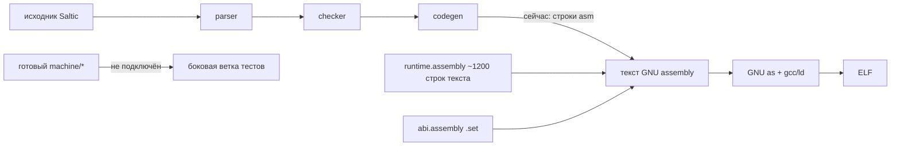

# Аудит компилятора и runtime — под философию Saltic

**Дата:** 2026-09-23
**Область:** `soul/seed/compiler*`, `soul/seed/runtime`, `soul/seed/abi*`,
`machine/*`, связь с VM и QEMU.
**Основание:** `PHILOSOPHY.md` (один путь, `rescue` — канон, типы — только
ради железа, память — квота, один язык на весь стек).
**Предыдущий аудит** `2026-08-24` аннулирован.

## Вердикт одним абзацем

Компилятор и ABI уже спроектированы правильно на уровне *идей* (теги значений,
raw fixed, отдельный error-регистр, object header), но **исполнение держится на
текстовой GNU-assembly строке**: codegen эмитит строки вида `"  lw a0, 0(s0)"`,
runtime — это константа из ~1200 строк assembly-текста, platform — `.S`-файлы,
а собственный машинный слой `machine/*` (кодировщик, раскладка, ELF) построен в
сторонке и **не подключён** к активной цепочке сборки. Это и есть пункт 6.
Объём перевода реален и конечен; архитектурная неоднозначность снята
PHILOSOPHY.md.

## Что уже правильно (не трогать)

1. **Модель значений — теги.** `abi/tags.saltic`: значение это 32-битное слово,
   младшие 3 бита — тег (number/answer/none/string/group/box/enum/error),
   старшие — payload. Raw fixed (`u8/u16/u32/i32/bits32/address/usize`) живут без
   тега, их тип берётся из сигнатуры. Это ровно «типы только ради железа»:
   тег нужен только managed-значениям, raw — только фиксированного размера.
2. **Ошибки уже де-факто под `rescue`.** `abi/call.saltic` закладывает отдельный
   `CALL_RETURN_ERROR_REGISTER`, `call.failure(error_id)`, `call.failed(result)`.
   `compile_rescue` генерит проверку тега `SALTIC_ABI_TAG_ERROR` и прыжок в
   обработчик. Канон соблюдён на уровне ABI.
3. **`error.X` — это только один тег.** `error_value()` в codegen превращает
   `error.NotEnoughEnergy` в `abi.error_value(...)` — то есть **это не второй
   механизм, а значение с тегом ERROR**, которое `rescue` ловит. Противоречия с
   PHILOSOPHY.md фактически нет: `error.X` уже сведён к «значение с тегом ERROR»,
   а `rescue` — его единственный перехватчик. Решение для пункта 6: оставить,
   уже согласовано.
4. **ABI полностью описан как контракт.** `abi.saltic` эмитит все `.set`
   определения из одной таблицы `abi/{tags,errors,fixed,value,call,object}`.
   Один источник истины для согласования compiler/runtime/тестов.

## Главная болезнь — текстовый assembly вместо `machine.Program`

Факт по коду:

- `compiler.saltic:compile()` вызывает `codegen.compile_functions` → `state.emit`
  строками вида `"  lw a0, 0(s0)"`, `"  addi sp, sp, -16"`, `"  call rt_add"`.
- `runtime/runtime.saltic` (`assembly()`) возвращает **константную строку**
  из ~1200 строк реального RISC-V assembly (rt_alloc, rt_group_*, rt_box_*,
  rt_file_*, ecall-обвязка, платформенные weak-символы).
- `runtime/memory.saltic` — ещё ~195 строк той же assembly.
- `state.saltic` хранит выход как `Output { chunks }` — строковый буфер, а не
  машинные слова. `finish_data()` эмитит `.text/.data/.rodata/.bss` директивы.
- `platform` — `os/bootstrap/platform.S` и `os/target/qemu_virt/platform.S`.

А **рядом лежит готовый, уже проверенный** `machine/*`:
- `machine/instruction.saltic` — таблица 44 команд (R/I/S/B/U/J + CSR/mret/wfi);
- `machine/codec.saltic` — кодировщик Word + chunked Buffer;
- `machine/layout.saltic` — раскладка host/qemu-virt;
- `machine/image.saltic` — ELF32 symtab/strtab/sections;
- `machine/profile.saltic` — 40 базовых + 4 машинные команды;
- `compiler/backend/rv32i.saltic` — хост-композиция (`rv32i.host/label/emit/branch/jump/resolve/executable`).

`machine` **уже гоняется** своими тестами (golden/immediate/patches/elf/scale,
132 проверки) и умеет создавать ELF, который исполняет собственная VM и QEMU.
То есть нижний этаж готов — не хватает только **поднять codegen/runtime с
«печатаем строки» на «собираем машинную программу»**.

## Граф разрыва

Цель пункта 6: `codegen` и `runtime` эмитят `machine.Program` (через
`codec`/`layout`/`image`), а GNU assembler/linker уходят из сборочной цепочки.

## Что мешает сделать это сразу (реальные, не выдуманные)

1. **Codegen завязан на строки и псевдокоманды.** Прямо эмитит `li`, `la`,
   `call`, `j`, `bgtu`, `csrr`, `csrw` — это **псевдо/GNU-инструкции**, которых
   нет в таблице 44 команд `machine/instruction`. Для `machine.Program` нужно
   lowering: `li` → `lui+addi` (или `addi`), `la` → `auipc+addi` (или 2-словная
   PC-relative), `call` → `auipc+jalr`, `j` → `jal zero`, `bgtu` → 2 команды.
   `machine` уже умеет branch/jump/PC-relative high/low — lowering это надстройка.
2. **Runtime — монолитная assembly-строка.** ~1400 строк нужно переписать как
   Saltic-код, эмитящий `machine.Program`, не текстовые строки. Это самый
   большой и самый механический кусок.
3. **Object header расходится.** `abi/object.saltic` задаёт 16-байтовый header
   (kind/payload_bytes/flags/auxiliary) и `FLAG_MARKED` (от mark-and-sweep!). Но:
   (а) активный `compile_group`/`compile_box` пишут в 0(count), а не header;
   (б) `FLAG_MARKED` — наследство отменённого mark-and-sweep. По «память = квота»
   header надо пересмотреть: какие поля реально нужны для квоты/запроса.
4. **Heap — фиксированный bump.** `state.finish_data` эмитит `.space 16 MiB`,
   bump-аллокатор `s1→s2` не освобождает. По PHILOSOPHY.md это **не** «утечка»,
   а «квота»: программа берёт сколько ей дано, кончилось — идёт к главному.
   Реальная механика «запроса добавки» ещё не спроектирована — это отдельная
   задача после перевода на machine (не блокер пункта 6).

## Оценка объёма пункта 6

Измерено по факту, не наугад:

| Кусок | Строк сейчас | Перевод |
|---|---:|---:|
| `runtime/runtime.saltic` + `memory.saltic` (assembly-строка → Saltic-эмиттер) | ~1387 | **~1500–2500** (крупнейший) |
| `codegen.saltic` + `state.saltic` (строки → `machine.Program`, lowering pseudo) | ~1312 | **~800–1500** |
| `abi.saltic` (`.set`-строки → константы в Program) | ~332 | **~100–200** |
| lowering псевдо-инструкций (li/la/call/j/bgtu/csrr/csrw) | 0 (нет) | **~200–400** (новое) |
| platform-контракт вынос (platform.S → Saltic) | 0 | **~200–400** |
| тесты перевода + closure | — | **~500–1000** |

**Итого: ориентир ~3300–6000 строк** нового/переписанного Saltic, с упором в
runtime. Это реалистично этапами, и это не «угадывание» — нижний этаж (machine)
уже несёт половину работы.

## Порядок перехода (рекомендация)

1. **Граница Program вместо строк.** Ввести в `state.saltic` выдачу не строк, а
   `machine.Program` (или общий `codec.Buffer`+раскладку), сохранив старый
   строковый путь на время перехода. Одна точка границы, не два backend.
2. **Lowering псевдо-инструкций** (li/la/call/j/bgtu) поверх `machine/codec` —
   они нужны и codegen, и runtime.
3. **Перевести runtime** с assembly-строки на Saltic-эмиттер `machine.Program`
   (самый крупный, делается механически, сверяется побайтово со старым `.s`).
4. **Перевести codegen** на `machine.Program` через backend.rv32i.
5. **Пересмотреть object header** под «память=квота»: убрать `FLAG_MARKED`
   (наследство mark-and-sweep), оставить поля, реально нужные для запроса квоты.
6. **Вынести platform-контракт**, убрать GNU as/gcc из `justfile`/`run.sh`.
7. **Closure-тест**: собранный ELF исполняется своей VM и QEMU, fixed point
   без GNU. Тогда — удалить `.S`, старый строковый путь, `li/la` как строки.

## Решения, которые нужны от владельца (по AGENTS.md — не мои)

Перечисляю честно, что я **не** решаю сам:

1. **Порядок перевода runtime vs codegen.** Рекомендую runtime первым (он
   изолированнее и сверяется побайтово), но это выбор.
2. **Object header под квоту.** Какие поля нужны, чтобы «попросить у главного»?
   Это новая сущность модели памяти — решение владельца, не исполнение.
3. **Оставить ли `error.X` как «тег ERROR»** (по факту уже так) или менять
   синтаксис. Рекомендую оставить — уже согласовано с `rescue`.
4. **Один Program-тип для codegen/runtime/image**, или раздельные. Рекомендую
   общий (уже есть `machine.Program`-идея в layout/image).

Пункты 2–4 я готов исполнять по твоему слову; пункт 1 — брать немедленно.
