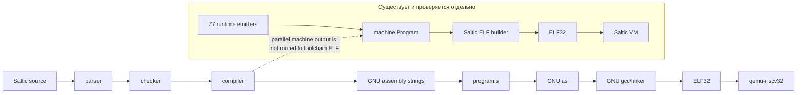

# Проверенный обзор текущего состояния Saltic

**Источник:** текущее рабочее дерево `/home/zephyr/dev/rnd/saltic`.
**Проверено:** 2026-09-24, чтением активных исходников, скриптов и истории Git.
**Тесты запускал владелец.** Последний подтверждённый результат: `5503/0` и
успешный повторный bootstrap fixed point после удаления legacy heap-`sed`.

Под активным стеком ниже понимаются текущие файлы проекта. `.archive/`,
`checkpoints/`, `.cache/` и документация не считаются исполняемой частью стека,
если это не оговорено отдельно.

## 1. Краткое состояние

1. Parser, checker, compiler, toolchain и VM написаны на Saltic.
2. Активный compiler возвращает текст GNU assembly, а toolchain записывает его в `.s`.
3. Активная сборка `.s` в ELF выполняется через `riscv32-none-elf-as` и `riscv32-none-elf-gcc`.
4. Bootstrap-компилятор запускается через `qemu-riscv32`.
5. Активный runtime по-прежнему берётся из строк `runtime.assembly()` и `memory.assembly()`.
6. В текущем рабочем дереве есть 77 функций `emit_*`, переводящих исполняемые точки runtime в `machine.Program`.
7. Тест `soul/seed/tests/machine/translation.saltic` вызывает все 77 из 77 функций.
8. Production-компилятор импортирует `seed.runtime.emit` и собирает все 77 функций в параллельный `machine.Program`.
9. `State` уже содержит параллельный машинный канал `machine = layout.Program {}` и `emit_op()`.
10. `compiler.compile()` всё ещё возвращает строковый `compiler.lines`; тот же проход заполняет `machine`, который возвращает отдельный `compile_machine()`.
11. `machine/codec.saltic`, `machine/layout.saltic` и `machine/image.saltic` умеют кодировать команды, разрешать метки и создавать ELF32.
12. Собственный ELF-builder используется тестами и тестовым генератором, но не основным compiler/toolchain.
13. VM на Saltic умеет загружать ELF32 и flat binary.
14. VM не загружает сама себя: запуск созданного ELF внутри VM не является self-load.
15. В активном стеке нет JavaScript-файлов. JS остался в архивных снимках.
16. GNU-based bootstrap fixed point повторно подтверждён 2026-09-24; прямого fixed point без GNU нет.
17. Базовый коммит перед текущим блоком — `a1eaaa7`, завершивший машинный codegen и секции данных.
18. Текущий блок приводит objects/fixed/memory к одному layout, обновляет bootstrap compiler и подтверждает GNU-based fixed point.

## 2. Фактическая активная цепочка

```text
*.saltic
  → parser.load_modules()
  → checker.check()
  → compiler.compile()
  → строка GNU assembly
  → seed.file.write(..., program.s)
  → riscv32-none-elf-as
  → program.o + linux-memory.o
  → riscv32-none-elf-gcc
  → ELF32
  → qemu-riscv32
```

| Этап | Файл и функция | Результат |
|---|---|---|
| Parser | `soul/seed/toolchain.saltic:18`, `parser.load_modules` | AST и diagnostics |
| Checker | `soul/seed/toolchain.saltic:24`, `checker.check` | проверенный AST/diagnostics |
| Compiler | `soul/seed/toolchain.saltic:30`, `compiler.compile` | строка assembly |
| Runtime | `soul/seed/compiler.saltic:16`, `runtime.assembly()` | строка assembly |
| Запись `.s` | `soul/seed/toolchain.saltic:31`, `seed.file.write` | файл `.s` |
| Запуск bootstrap | `os/bootstrap/build.sh:30` | `.s` через `qemu-riscv32` |
| Ассемблирование | `os/bootstrap/link.sh:34,36` | два `.o` |
| Линковка | `os/bootstrap/link.sh:39` | ELF |

## 3. Компоненты

| Компонент | На Saltic | В production compile | Фактический выход |
|---|---:|---:|---|
| Parser | ДА | ДА | AST + diagnostics |
| Checker | ДА | ДА | diagnostics и проверенный AST |
| Compiler | ДА | ДА | строка GNU assembly |
| Строковый runtime | ДА, как Saltic-функция со строкой | ДА | строка GNU assembly |
| `runtime/emit.saltic` | ДА | ДА, параллельный канал | `State` с заполненным `machine.Program` |
| Machine codec/layout | ДА | ДА, параллельный канал | машинные слова, секции, метки и patches |
| ELF generator | ДА | НЕТ | ELF32 buffer/file |
| VM | ДА | НЕТ, используется тестами и tracer | результат исполнения образа |
| ELF/flat loader | ДА | НЕТ, часть VM | загруженная память и entry PC |
| Toolchain | ДА | ДА | файл `.s` |
| Bootstrap wrapper | Bash | ДА | ELF через QEMU + GNU |

## 4. Runtime и машинный канал

В `soul/seed/runtime/emit.saltic` определено ровно 77 уникальных функций
`emit_*`. В `soul/seed/tests/machine/translation.saltic` присутствуют вызовы
всех 77 функций: неопределённых вызовов и функций без тестового вызова нет.

Эти функции проверяются как отдельные машинные фрагменты: байты, метки,
patches и разрешение ссылок. Production-компилятор собирает их в параллельный
`machine.Program`, но основной toolchain пока берёт строковый результат и не
создаёт из этого `Program` обычный ELF.

Активный `soul/seed/compiler.saltic` делает следующее:

```text
abi.assembly() → header/start → строковый codegen
→ runtime.assembly() → строковые constants/data
→ render_lines(compiler.lines)

параллельно: machine codegen → append_runtime()
→ machine constants/data/bss → compiler.machine
```

`compiler.compile()` возвращает строковый результат, `compile_machine()` —
`machine.Program`. Основной toolchain вызывает первый путь и пока не передаёт
машинный результат в `machine.image`.

## 5. ELF и машинный слой

- `machine/instruction.saltic` описывает 44 команды.
- `machine/codec.saltic` кодирует машинные слова RV32.
- `machine/layout.saltic` содержит `Program`, секции, labels, patches и `resolve()`.
- `machine/image.saltic:174` создаёт настоящий ELF32 для RISC-V.
- `machine/image.saltic:271` записывает ELF через `seed.file.write_bytes`.
- `soul/seed/tests/machine/qemu.saltic` создаёт ELF собственным builder, исполняет его в Saltic VM и записывает на диск.
- `soul/seed/tests/stages/03-machine.sh` запускает генератор и полученный ELF через `qemu-riscv32`.
- Основной `compiler.saltic` не импортирует `machine.image` и не вызывает ELF-builder.

## 6. Bootstrap

`os/bootstrap/build.sh` запускает `os/bootstrap/compiler.elf` через
`qemu-riscv32`, получает `.s` и передаёт его в `os/bootstrap/link.sh`.

`os/bootstrap/link.sh`:

1. Проверяет наличие `.space SALTIC_HEAP_BYTES` и передаёт размер через `as --defsym`.
2. Собирает `os/bootstrap/linux-memory.S` через GNU `as`.
3. Собирает сгенерированный `.s` через GNU `as`.
4. Связывает оба объекта через GNU `gcc`/linker.

`os/bootstrap/refresh.sh` строит stage-1, stage-2 и stage-3, сравнивает `.s`
через `diff`, ELF через `cmp` и заменяет `os/bootstrap/compiler.elf`
результатом stage-3.

Текущий `os/bootstrap/compiler.elf` имеет SHA-256
`4784389db216386a90179757962427c5b82706c796aada0a8d1c29da4913b470`.
Он был обновлён 2026-09-24 после GNU-based fixed point. Это не доказательство
bootstrap без GNU.

## 7. VM и загрузчик

Активная VM находится в `soul/seed/vm.saltic` и `soul/seed/vm/*.saltic`.
Активного каталога `s2/vm/` нет.

- `vm/loader.saltic:53` загружает flat binary.
- `vm/loader.saltic:62` загружает ELF32 RISC-V по program headers.
- VM поддерживает process mode и machine mode.
- Process mode обрабатывает Linux-подобные syscalls.
- Machine mode содержит CSR, traps, `mret`, `wfi`, UART и test MMIO.
- VM получает образ извне и загружает его в моделируемую память.
- Подтверждённого self-load, где VM загружает и исполняет саму себя, нет.

## 8. Внешние инструменты

Для подсчёта использованы активные `justfile`, shell-скрипты и workflow.
Исключены `.archive/`, `checkpoints/`, `.cache/`, документация, shebang,
сообщения и проверки наличия через `command -v`.

| Инструмент | Точки вызова |
|---|---:|
| Bash | 42 |
| `qemu-riscv32` | 33 |
| `qemu-system-riscv32` | 4 |
| `riscv32-none-elf-as` | 4 |
| `riscv32-none-elf-gcc` | 5 |
| `riscv32-none-elf-objcopy` | 3 |
| GDB, вызываемый через переменную | 1 |
| `nix` | 3 |
| `sed` | 3 |
| **Всего** | **98** |

Это не число вообще всех Unix-команд: `mkdir`, `grep`, `awk`, `diff`, `cmp`,
`cp`, `sha256sum` и другие бытовые утилиты в 98 не включены.

## 9. Git

Базовый коммит перед ревизуемым блоком:

```text
a1eaaa7
compiler: завершить машинный codegen и секции данных
```

Следующий блок объединяет object/fixed ABI, квоту памяти, параметрический heap,
bootstrap fixed point и обновлённый `compiler.elf`. Его подтверждённые проверки:
`5503/0` и повторный `bootstrap-refresh` без legacy heap-`sed`.

## 10. Проверенные ответы на исходные вопросы 1–50

### Компилятор

1. Компилятор генерирует ELF напрямую, без промежуточного `.s`? — **НЕТ**.
2. Компилятор всё ещё выдаёт ассемблерный текст `.s`? — **ДА**.
3. Компилятор всё ещё вызывает `riscv32-none-elf-gcc`? — **ЧАСТИЧНО**: Saltic-компилятор возвращает текст, а GCC вызывает build-wrapper.
4. Компилятор всё ещё вызывает `riscv32-none-elf-as`? — **ЧАСТИЧНО**: `as` вызывает `os/bootstrap/link.sh`.
5. Компилятор всё ещё вызывает `objcopy`? — **НЕТ**. `objcopy` используется только тестами.
6. Runtime (`_start`, `rt_*`, `saltic_*`) всё ещё представлен строками assembly? — **ДА**.
7. Runtime генерируется кодогенератором `emit_addi`, `emit_sw` и подобными? — **ЧАСТИЧНО**: 77 эмиттеров существуют и тестируются, но активный compiler их не использует.
8. В репозитории есть свой ассемблер на Saltic? — **НЕТ**.
9. В репозитории есть свой линкер на Saltic? — **НЕТ**.
10. В репозитории есть свой генератор ELF на Saltic? — **ДА**.

### Bootstrap

11. `os/bootstrap/compiler.elf` всё ещё собран внешним GCC? — **ДА**.
12. `os/bootstrap/compiler.elf` собирается самим Saltic? — **ЧАСТИЧНО**: Saltic создаёт `.s`, GNU создаёт ELF.
13. `os/bootstrap/refresh.sh` всё ещё использует `sed` для heap? — **НЕТ**.
14. `os/bootstrap/build.sh` всё ещё вызывает `qemu-riscv32`? — **ДА**.
15. `os/bootstrap/build.sh` всё ещё вызывает `riscv32-none-elf-gcc`? — **ЧАСТИЧНО**: косвенно через `link.sh`.
16. `os/bootstrap/build.sh` всё ещё вызывает `riscv32-none-elf-as`? — **ЧАСТИЧНО**: косвенно через `link.sh`.

### VM и загрузчик

17. VM на Saltic в `s2/vm/*.saltic` умеет читать ELF? — **ЧАСТИЧНО**: `s2/vm/` отсутствует, текущая `soul/seed/vm` умеет.
18. VM на Saltic умеет читать flat binary? — **ДА**.
19. VM умеет сама себя загружать, self-load? — **НЕТ**.
20. Загрузчик ELF написан на Saltic? — **ДА**.
21. Загрузчик ELF всё ещё находится в активном `js/4-vm.js`? — **НЕТ**.

### Сборка и окружение

22. Активный `justfile` всё ещё вызывает `nix-shell`? — **НЕТ**.
23. Активный `justfile` всё ещё вызывает `qemu-riscv32`? — **ДА**.
24. Активный `justfile` всё ещё вызывает `riscv32-none-elf-gcc`? — **ДА**.
25. Активный `justfile` всё ещё вызывает Bash? — **ДА**.
26. Есть способ собрать Saltic без Nix? — **ДА**, если зависимости уже установлены.
27. Есть активный способ собрать Saltic из исходников без QEMU? — **НЕТ**.

### Что уже замкнуто

28. Parser на Saltic работает без JS? — **ДА**.
29. Checker на Saltic работает без JS? — **ДА**.
30. Compiler на Saltic работает без JS? — **ДА**.
31. VM на Saltic работает без JS? — **ДА**.
32. Toolchain на Saltic работает без JS? — **ДА**.
33. Есть полностью замкнутый на Saltic вертикальный слой? — **ЧАСТИЧНО**: компоненты JS-free, но их сборка и исполнение зависят от GNU, QEMU и Bash.

### Что осталось

34. Сколько основных внешних инструментов нужно обычному `just compile` после запуска `just`? — **4**: Bash, `qemu-riscv32`, GNU `as`, GNU `gcc`/linker.
35. Какие дополнительные инструменты участвуют в тестах и окружении? — `objcopy`, `qemu-system-riscv32`, GDB и опционально Nix.
36. Что мешает убрать GCC? — Он связывает `program.o` и `linux-memory.o`; собственный image-builder не получает результат active compiler.
37. Что мешает убрать GNU `as`? — Active compiler/runtime производят `.s`, а bootstrap использует `linux-memory.S`.
38. Что мешает убрать `qemu-riscv32`? — Bootstrap compiler и программы являются RV32 ELF; другого активного host-исполнителя в build-path нет.
39. Что мешает убрать `sed`? — Канонической сборке он уже не нужен; оставшиеся вызовы обслуживают тесты и tracer.
40. Что мешает убрать Bash? — Bootstrap, tests, dev-shell и release orchestration находятся в shell-скриптах.

### Файлы и точки

41. Сколько точек вызова основных внешних инструментов найдено? — **98** по методике раздела 8.
42. Активные файлы с вызовами `riscv32-none-elf-*`: `justfile`, `os/bootstrap/heap-audit.sh`, `os/bootstrap/link.sh`, `os/target/qemu_virt/build-graphics.sh`, `tests/run.sh`.
43. Активные файлы с реальными вызовами `qemu-riscv32`: `justfile`, `os/bootstrap/build.sh`, `os/bootstrap/heap-audit.sh`, `os/target/qemu_virt/build-graphics.sh`, `soul/seed/tests/stages/03-machine.sh`, `tests/run.sh`.
44. Активные файлы с вызовами `nix-shell`: **нет**. Совпадения находятся только в `.archive/` и `checkpoints/`.
45. Активные файлы с вызовами `sed`: `justfile`, `tests/run.sh`.
46. Активные файлы с вызовами GCC: `justfile`, `os/bootstrap/link.sh`, `os/target/qemu_virt/build-graphics.sh`, `tests/run.sh`.

### Последнее состояние Git

47. Базовый коммит перед текущим блоком — `a1eaaa7`, `compiler: завершить машинный codegen и секции данных`.
48. Текущий блок завершает object/fixed ABI, квоту памяти и обновление bootstrap compiler после fixed point.
49. На момент ревизии блок подтверждён результатом `5503/0` и повторным `bootstrap-refresh`.
50. Точный текущий Git-статус следует проверять через `git status`; снимок изменяемых файлов больше не закрепляется в обзоре.

## 11. Итоговая карта



Незамкнутые фактические границы:

1. Production compiler заполняет `machine.Program`, но toolchain выбирает строковый результат.
2. Production codegen продолжает параллельно выдавать assembly-строки.
3. Production toolchain не передаёт `machine.Program` в `machine.image`.
4. Bootstrap `.s → ELF` зависит от GNU assembler и linker.
5. Bootstrap-компилятор запускается через QEMU.
6. Прямой ELF fixed point без GNU не реализован.
7. `soul/seed/tests/closure.saltic` отсутствует; stage 8 остаётся незакрытым.
